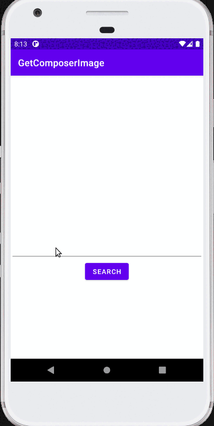

# SimpleDataScrapper
Simple application for scrapping information about composers and music albums from wikipedia and duck duck go search engine.
 <b>Data is scrapped from:</b>
- https://duckduckgo.com/
- https://www.wikipedia.org/

<b>User can search for:</b>
- composer image, by composer names,
- album release year by album name,
- album author by album name.

<b>Used technologies:</b>
- Jsoup for downloading and parsing search result html,
- Courutines for not running search on main thread,
- Picasso for downloading images.

<b>App screenshots:</b>
App start screen        |  Example of search screen
:-------------------------:|:-------------------------:
  |   

<b>App during usage:</b>
Search for album year        |  Search for album author | Search for composer image
:-------------------------:|:-------------------------:|:-------------------------
  |   | 
